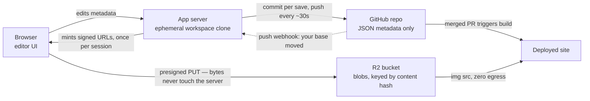
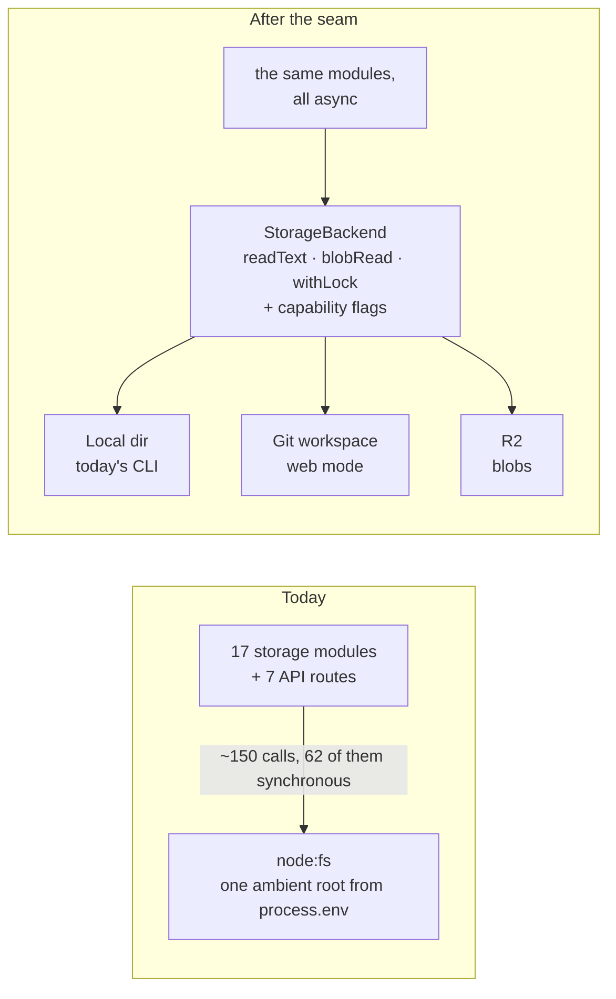
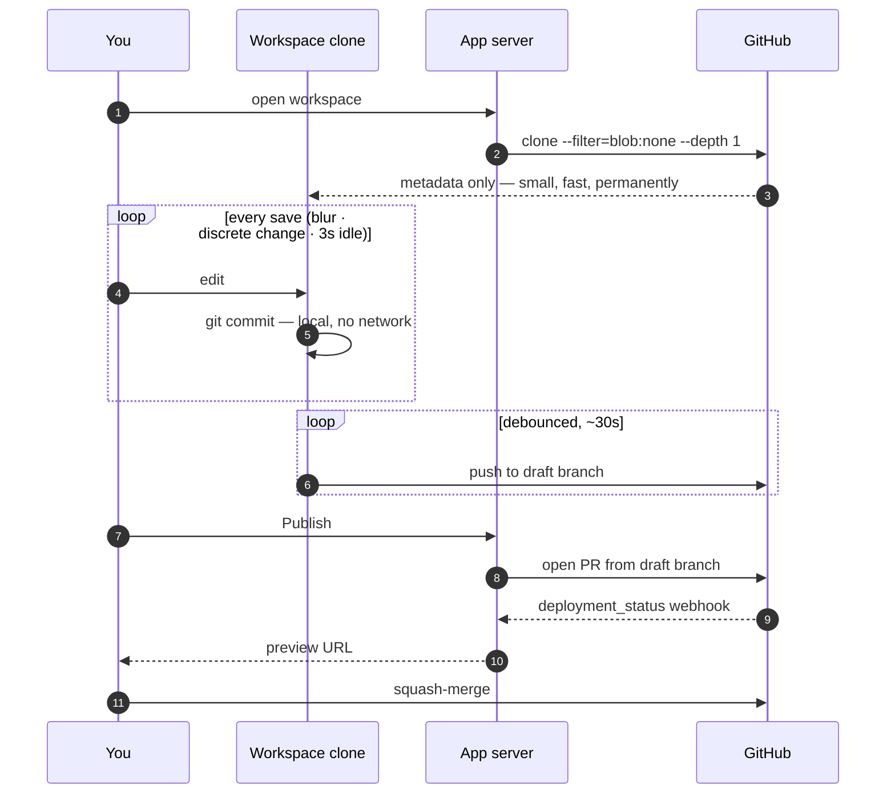
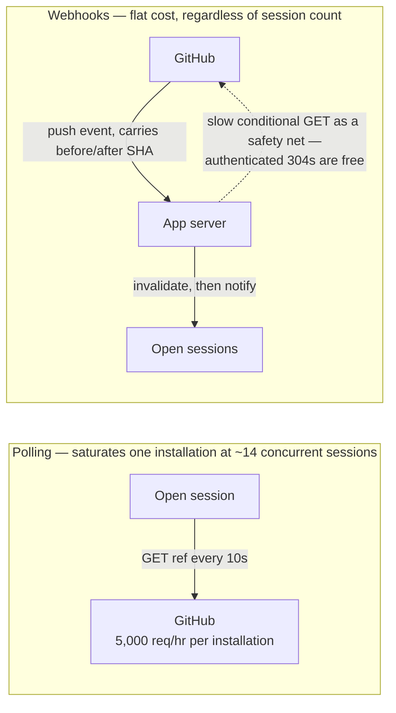
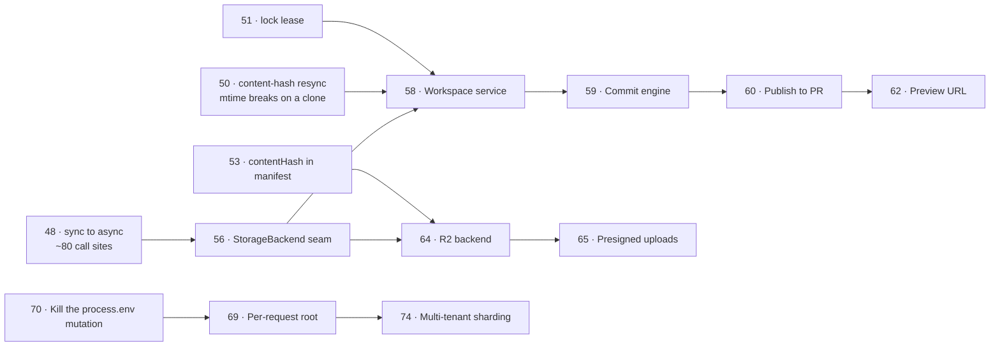

# Media Manager on the Web

**Status:** exploration + roadmap · **Date:** 2026-08-18 · **Backlog numbers start at 47**

Can media-manager run as a hosted web app, connected directly to a GitHub repo, publishing changes back as a branch and PR — so you can edit a site from anywhere?

**Yes.** It is a substantial refactor, not a rewrite. The architecture is sound and the storage layer is ~85% of the way to a clean seam. The surprising result of the audit is that the piece everyone assumes is the blocker — making the app serve many data roots at once — is roughly a ten-line change. The real work is elsewhere: converting synchronous I/O to async, designing the commit story, and fixing five concurrency bugs that already exist today.

---

## What you decided

These came out of the Q&A and are treated as fixed constraints throughout:

| Decision | Choice |
|---|---|
| Audience | You + a friend now; multi-tenant product eventually |
| Repos | Must already contain a media-manager data root |
| GitHub auth | GitHub App (installable per-repo) |
| Write model | Batched **Publish** → branch + PR |
| Draft durability | Continuously push to a draft branch now; server-side persistent workspaces later |
| Drift | Detect the base moved, prompt to refresh |
| Codebase | One codebase, two modes, behind an adapter seam |
| Preview | Surface the Vercel preview URL for the PR |
| Privacy | Handle both public and private repos |
| Mobile | Nice-to-have, desktop first |
| Scale | Hundreds of files now, bigger later |
| Cost | Not the constraint — optimize for the product |

---

## The shape of the answer

Four layers, each with a clear owner:

1. **Identity & access** — a GitHub App provides both OAuth sign-in and per-repo installation tokens. The server holds the tokens; the browser never sees them.
2. **Workspace** — on session start, the server clones the repo to an ephemeral scratch disk under an opaque UUID directory and runs the existing app against it. Git is the database; disk is the cache.
3. **Blobs** — media lives in object storage (Cloudflare R2), addressed by content hash. The repo holds JSON metadata only.
4. **Publish** — edits land as commits on a draft branch; **Publish** opens a PR; the deploy preview URL is surfaced back in-app.

*The load-bearing split: metadata flows through the server and into git; blob bytes go browser-to-bucket and never enter the request path. The dotted arrow is the only thing that tells a live session the world changed underneath it.*

### Why a clone, when every comparable CMS avoids one

This is worth stating plainly because the research pushed back on it. Decap, Sveltia, Keystatic, Pages CMS, Static CMS and Tina's write path all skip the server-side clone and commit through GitHub's API. Only CloudCannon keeps a clone — and it's also a build platform running real static-site generators.

They can skip it because they edit **text**. media-manager cannot, for three specific reasons:

- **ExifTool's API is path-based.** It spawns a long-lived child process and reads from a file path — it cannot take a stream or a key. Metadata read/strip drives six routes.
- **`reconcile()` treats `readdir` as the source of truth** and runs on *every* list request. Against object storage that becomes a paginated, billed, eventually-consistent LIST on every page load.
- **`sharp` just became a live dependency** with the compression work — derivative generation wants a filesystem and CPU.

The audit's estimate: a clone-based backend is roughly **25% of the work** of a no-filesystem backend, and both share the same adapter seam. Clone now; the seam leaves the API-only path open later if it's ever worth it.

---

## The problem map

### A. Making one process serve many roots

**The good news.** `getRootDir()` reads `process.env.MEDIA_MANAGER_ROOT` on *every call* — no caching, no memoized singleton. A sweep for module-level mutable state holding a root found **none**. No function anywhere takes a root parameter; it's always ambient. So swapping the body for `AsyncLocalStorage.getStore()?.root ?? process.env…`, plus a `hooks.server.ts` wrapper that resolves the tenant per request, makes all 23 path accessors per-request for free.

**The three things that actually block it:**

1. **`applyStorageEnv()` mutates `process.env` at runtime** (`server/storageConfig.ts`). This is a deliberate feature in single-tenant mode — change your storage location without a restart. In multi-tenant mode it is a **cross-tenant data-corruption bug**: tenant A changing their storage location redirects tenant B's blob reads and writes. Must become per-tenant state. Small fix, hard blocker — do not ship tenancy with it in place.
2. **The layout guard memoizes once per process** (`hooks.server.ts`). One bad tenant root would 500 *every* tenant, forever. Needs a `Map<root, Error|null>`.
3. **`exiftool-vendored` is a process-wide singleton child process**, and the Google Photos OAuth flow binds a process-wide port.

### B. Sync I/O is the gating refactor

About **20 exported functions do blocking synchronous disk I/O**, called from **~80 sites** — `listClassIds()`, `listMediaTypes()`, `getMediaTypePaths()`, the five settings modules, the layout guard. Roughly 62 synchronous `fs` calls across non-test `src/`.

A clone is a real filesystem, so this isn't strictly *required* for phase 1 — but it blocks a shared lock service, blocks object storage, and blocks every later option. The audit's strongest recommendation: **do this first, against local disk, with the test suite green, before any second backend exists.** It's mechanical, wide, and independently valuable.

There's a hidden second chokepoint worth exploiting: **`json.ts` is 50 lines and four functions**, and the entire 993-line records subsystem goes through it with exactly one exception. Retarget `json.ts` and the records side ports nearly for free. Four asymmetric raw `readFileSync` calls in `classRepo.ts` that bypass it are the cheapest thing to fix first.

*The refactor in one picture. Today `paths.ts` hands out strings and seventeen modules each do their own I/O against them; the seam hands out keys instead, and the three backends become interchangeable. The capability flags exist so callers can degrade honestly — S3 has no atomic rename, git has no reliable mtime.*

### C. The commit story

**Nothing in `src/` references git at all.** Today a write is `writeTextFileAtomic` — tmp file plus rename — which produces a dirty worktree and nothing else. Someone has to design commit/push/conflict. This is the single largest piece of genuinely new work.

The constraint that shapes it: GitHub recommends **≤6 pushes per minute** per repo, and the API's secondary limit is **~80 content-generating requests/minute** — the real ceiling, not the 5,000/hour primary limit. Autosave fires on blur, on discrete change, and on a 3s idle timer across three editors. Pushing per save would blow straight through both.

**The resolution:** commit locally on every save (cheap, no network, gives crash recovery), and **push on a debounce** — every ~30 seconds or on idle. Bounded loss, well under the limits.

**Publish:** additive commits on the draft branch, then **squash-merge** the PR. The alternative — force-pushing a pre-squashed commit on every save — needs amend/reset/force logic running unattended, where a race between two writers silently destroys work. Squash-at-merge needs none of that and maps cleanly onto git's primitives.

Other write-path facts worth knowing, mostly relevant if the API path is ever revisited:

- Installation tokens last **exactly one hour** with no refresh endpoint — re-mint from the still-valid JWT. Long clone/push operations need their own re-auth.
- Only GraphQL `createCommitOnBranch` produces **Verified** commits and has **built-in optimistic concurrency** (`expectedHeadOid`). The Git Data API has none — manual read-compare-then-update-ref, which is a real race-condition bug class.
- The `[bot]` commit badge needs the bot account's **numeric user ID** in the noreply email, not the App ID. Getting this wrong silently produces unverified, unbadged commits.
- Enable `delete_branch_on_merge` at provisioning. Abandoned draft branches need your own sweep — there's a **5,000-branch hard ceiling** and no native staleness enforcement.

*Why the two loops run at different speeds: GitHub recommends no more than 6 pushes per minute, and the API's binding secondary limit is ~80 content-writes per minute. Autosave fires far faster than that, so saves commit locally and only the push is debounced — durability with bounded loss.*

### D. Drift detection

Webhooks, not polling. Naive 10-second polling per session **saturates an installation's entire hourly budget at ~14 concurrent sessions** on drift-checking alone.

Subscribe the App to `push`; the payload carries `before`/`after` SHAs directly, so no follow-up GET is needed. Keep a slow conditional-GET poll as a safety net, since webhook delivery isn't guaranteed — an authenticated `304` from `If-None-Match` on the ref endpoint **doesn't count against the rate limit**, and the endpoint even returns `x-poll-interval: 300` as a suggested floor. Don't use the Compare API to *detect* drift (heavy, not exempt); use it after the fact to get ahead/behind counts.

*The difference worth drawing: polling cost scales with sessions, webhook cost does not. The dotted arrow stays because webhook delivery is not guaranteed — but a 304 from `If-None-Match` costs nothing against the budget.*

### E. Concurrency — five bugs that already exist

These are live today at single-user scale and get much worse over network I/O:

1. **The 10-second stale-steal is a corruption vector.** Any operation holding a lock longer than 10s has it unconditionally stolen, and both writers then write. `migrateBlobs` holds the *manifest* lock for an entire blob copy — moving 50 GB blows past 10s by orders of magnitude. Must become a renewed lease.
2. **Lock acquisition gives up after ~4.1 seconds** and throws — surfacing as a 500 rather than queueing.
3. **Settings writes are unlocked read-modify-write** in five modules. Two concurrent PATCHes lose one.
4. **Upload has a TOCTOU race** — `uniqueName()` probes with `existsSync` in a loop, so two concurrent uploads of the same filename can both resolve to `foo (1).jpg` and one silently overwrites the other.
5. **EXIF strip writes `<base>.tmp.<ext>` into the blob directory itself.** A concurrent list request will `readdir` that temp file and mint it a manifest id as a new blob, which then goes `missing: true` a moment later.

And one that only appears under a clone: **the mtime-gated resync breaks outright.** `classRepo` compares `statSync(classFile).mtimeMs > statSync(manifest).mtimeMs`, but **git does not preserve mtimes** — a fresh checkout stamps everything with checkout time. Either every class file looks newer than the manifest (full resync on every cold start) or they're all identical and the gate never fires. This is a correctness bug, not a perf note. Replace with a content hash or a version counter — which is already on the board as **Item 42**.

**Also: never run two instances against one root.** The `fs.open(path, 'wx')` sentinel is only atomic on a local POSIX filesystem. On NFS, SMB, or overlayfs — exactly what you'd use to share a clone — `O_EXCL` is not reliably atomic, and the mtime-based steal compounds it with clock skew. Single-writer per workspace must be enforced above the app, via sticky routing.

### F. Where blobs live

Git LFS is a trap: `raw.githubusercontent.com` and GitHub Pages serve the **pointer file, not the binary**, unless CI checks out with `lfs: true`; bandwidth is metered; and GitHub has **discontinued pre-paid data packs** in favor of pure metered billing.

**Recommendation: Cloudflare R2**, metadata-only in the repo. Zero egress is the decisive factor for a public site serving image traffic. ~$0.75/month at 50 GB.

**Add `contentHash` to manifest entries now**, before any of this ships. Keep the UUID as the manifest entity id — every `file`-type field reference keeps pointing at it, so nothing upstream changes — and key the *storage path* by hash. That buys automatic dedup, `Cache-Control: immutable` URLs that never need invalidation, integrity checking for free, and it's far cheaper to add at hundreds-of-files scale than to retrofit.

⚠️ **`ManifestEntrySchema` is a bare `z.object`, so zod strips undeclared keys, and every mutator round-trips read→parse→mutate→write.** A `contentHash` that isn't declared on the schema *and* whitelisted in the reader's hand-rolled `parseManifest` will silently vanish on the next unrelated write.

**Splitting metadata from blobs means the repo alone stops being a complete backup.** Every tool in this space solves it the same way — commit the hash, ship a bulk-materialize command. git-annex has `annex get --all`, DVC has `dvc pull`, LFS has `lfs fetch --all`. media-manager needs a `fetch-all` verb that walks the manifest and downloads anything missing, verifying against the recorded hash.

### G. Serving bytes

`GET /api/files/[id]/blob` is the weakest route in the app **today**, independent of any of this: it stats the file twice, then does a **synchronous whole-file `readFileSync` on the event loop**. No streaming, no Range (so `<video>` seeking is broken), no ETag, no Last-Modified, no Cache-Control, no conditional GET. Content-Type comes from a hardcoded 10-entry map, so `.mov`, `.avif`, `.heic`, `.tif` all fall through to `application/octet-stream`. Every grid render re-reads and re-transfers every thumbnail at full resolution, uncached.

Fixing it locally is half a day. In the web version the right answer deletes the problem: return a **302 to a signed CDN URL**, with in-process proxying only as a fallback.

For private content, two findings matter:

- **`raw.githubusercontent.com` 404s with installation tokens on private repos** — an undocumented, unsupported auth path. Route everything through `api.github.com` and **cache by git blob SHA**, which is content-addressed and immutable, so a SHA-keyed URL carries `max-age=31536000, immutable` with zero invalidation logic. (GitHub's own ETag on the raw response *is* the blob SHA.)
- **R2 presigned URLs only validate against the raw R2 endpoint, not a custom domain.** A custom domain needs a Worker validating an HMAC token, or Cloudflare's WAF Token Authentication (Pro plan+).
- **CDNs cache the response body, not the signature's validity.** Private-but-signed images edge-cache fine — but rotating signatures bust the *browser's* cache on every reload, since it keys by exact URL. For a gallery of hundreds of thumbnails, mint URLs **once per session**, not once per render, and batch issuance into the list response.

### H. Things that must be rewritten or moved

- **Google Photos OAuth binds a `node:http` server on `127.0.0.1`** and expects the browser to reach it on the same machine. That's a desktop-app pattern; hosted needs a normal redirect URI. Full rewrite.
- **`<root>/media/google.json` holds an OAuth refresh token at chmod 0600 — inside the data root.** If the root is a git repo, **that gets committed.** Must move to a secret store before anything ships. This is a security blocker, not a cleanup.
- **`assetsMigrate.ts`** (316 lines, including a `statfsSync` free-space probe) is a local-disk feature end-to-end. It gets replaced, not ported.
- **The `derived/` compression tree** that just landed is rebuildable by definition — gitignore it in repo mode and generate into object storage. And decide now that **derivative generation never runs in the request path**; route it to a worker. Deciding this today costs nothing and saves a painful unwind, since `sharp` is a native binary that constrains every hosting option.

### I. Tenancy and security

- **Installation presence is not permission to write.** Verify the signed-in user's own `permissions.push` live before every push — cache briefly for UI, never for the write path.
- **Never build filesystem paths from `owner/repo` strings.** Opaque workspace UUIDs, realpath-canonicalized before any file operation.
- `git clone` does not itself execute repo hooks — but there's a real CVE class around submodule + symlink hook RCE (CVE-2024-32002 and relatives). Mitigate: no submodule recursion by default, `core.symlinks=false`, current git, restricted protocol allowlist, unprivileged clone process.
- Rate limits are **per installation** (5,000–12,500/hr), so they scale with tenants rather than becoming a shared ceiling. Good news for the multi-tenant path.
- Handle `installation.deleted` and `installation_repositories.removed` webhooks for revocation, with the live re-check as a backstop for access lost outside a webhook.
- Minimal data model: `users`, `sessions`, `installations`, `installation_repositories`, `workspaces`, `audit_log`.
- Marketplace verification isn't needed until you list publicly or charge — irrelevant for phase 1.

### J. Hosting

**Don't reach for a persistent volume.** Fly, Railway, Render and generic VPS block storage are all **single-attach** — a Fly volume cannot be shared across two running Machines. Only AWS EFS is genuinely multi-mount, and it's 10–100× slower than local disk at exactly the operation this app does at session start: git's tree walk. There's a documented production incident of `git clone` degrading to **51 KB/s** on EFS.

Every platform converges on the same shape: **ephemeral scratch disk, re-clone per session, GitHub as the durable store.**

- **Phase 1:** a single Hetzner CX-series VPS, ~€9–11/month. Native-speed git and image processing, no serverless ceilings to fight.
- **Phase 2:** shard across boxes with a tenant→box registry. Not Kubernetes, not EFS.
- **Ruled out:** Cloudflare standard Workers (no filesystem, no subprocess — ExifTool and sharp are simply impossible), Render with disks (dead-ends past a handful of tenants), Fargate + EFS.

Clone latency is manageable with `--filter=blob:none --no-checkout --depth 1 --sparse` — especially once blobs live in R2 and the repo is metadata-only, at which point a clone is small and fast permanently.

Running cost at phase 1: roughly **$12/month** all-in (VPS + R2 + a free GitHub App).

---

## 🔴 Fix this week, regardless

`npm audit` flags **`exiftool-vendored` as high severity**. The pin is `^25.0.0` (25.2.0 installed); current is **37.2.0** — an argument-injection bug via unsanitized stdin interpolation, reported as CVE-2026-43893 (CVSS 8.2), fixed in ≥35.19.0.

That's a 12-major-version gap, so it's not a drive-by bump — expect API changes. It matters locally; it matters a great deal more in a hosted app processing files whose names other people control.

---

## Roadmap

*Two items gate almost everything downstream: the sync-to-async conversion (48) and the seam it enables (56). Both live in Phase 0/1 and both improve the local app on their own. Item 70 is small but absolute — per-request roots are unsafe until the runtime `process.env` mutation is gone.*

### Phase 0 — Harden what exists (no web, all independently valuable)

Every item here improves the local app on its own merits and is a prerequisite for the web version. This is the phase to do while the design settles.

| # | Item | Size |
|---|---|---|
| 47 | Upgrade `exiftool-vendored` 25 → 37 (security) | S |
| 48 | Convert the ~20 sync storage exports to async (~80 call sites); retarget `json.ts`; fix the 4 asymmetric raw reads in `classRepo` | **L** |
| 49 | Rewrite `/api/files/[id]/blob`: stream, Range, ETag, Cache-Control, real MIME map | S |
| 50 | Replace the mtime-gated resync with a content hash or version counter (folds in **Item 42**) | M |
| 51 | Lock hardening: renewed lease instead of the 10s steal, queue instead of throwing at 4.1s, lock the five unlocked settings writes | M |
| 52 | Fix the upload TOCTOU and move EXIF temp files out of the scanned blob directory | S |
| 53 | Add `contentHash` to manifest entries — declared on `ManifestEntrySchema` **and** whitelisted in the reader's `parseManifest` | S |
| 54 | Move the Google OAuth secret out of the data root into a secret store | S |
| 55 | Decide and enforce: derivative generation never runs in the request path | S |

### Phase 1 — Single-tenant web, just you

The goal: open a browser anywhere, edit nicb.at's workspace, publish a PR, see the preview.

| # | Item | Size |
|---|---|---|
| 56 | `StorageBackend` interface + local-filesystem implementation behind it, with capability flags (`atomicRename`, `reliableMtime`, `cheapList`, `signedUrls`) | L |
| 57 | GitHub App: registration, OAuth sign-in, installation flow, token minting, live `permissions.push` verification | M |
| 58 | Workspace service: clone to an opaque UUID dir, sticky single-writer, idle eviction, re-clone on demand | L |
| 59 | Commit engine: local commit per save, debounced push (~30s), draft branch per session | L |
| 60 | Publish: open PR, squash-merge, `delete_branch_on_merge`, abandoned-branch sweep | M |
| 61 | Drift: `push` webhook → invalidate → notify open sessions; conditional-GET poll as safety net; "refresh workspace?" UI | M |
| 62 | Deploy previews: `deployment_status` webhook (Vercel) with a Deployments-API poll fallback, surfaced on the PR in-app | S |
| 63 | Deploy: Hetzner VPS, HTTPS, webhook endpoint with HMAC verification | M |

### Phase 2 — Blobs out of the repo

| # | Item | Size |
|---|---|---|
| 64 | R2 backend behind `StorageBackend`; content-hash-keyed storage paths | M |
| 65 | Presigned PUT direct from the browser; server mints URLs only, stays out of the byte path | M |
| 66 | Signed-URL issuance for private workspaces (Worker or app-minted), batched per session; public `baseUrl` path for public repos | M |
| 67 | `media-manager fetch-all` — rematerialize blobs locally from the manifest, so a clone is recoverable again | S |
| 68 | Blob route returns 302 to CDN; proxy only as fallback | S |

### Phase 3 — Two users, then many

| # | Item | Size |
|---|---|---|
| 69 | `AsyncLocalStorage` per-request root; per-root layout-guard memo | S |
| 70 | Kill `applyStorageEnv()`'s `process.env` mutation — per-tenant storage config (**blocker for tenancy**) | S |
| 71 | Persistent store: users, sessions, installations, repos, workspaces, audit log | M |
| 72 | Isolation hardening: UUID paths + realpath canonicalization, clone sandboxing, disk quotas, per-tenant rate limiting | M |
| 73 | Revocation: `installation.deleted` / `installation_repositories.removed` handling | S |
| 74 | Tenant→box registry and sharding | L |

### Deferred, deliberately

- **No-filesystem / serverless backend.** ~4× the work, and it costs ExifTool and sharp.
- **Git LFS.** Enforce a ~90 MB soft cap instead; revisit only if users actually hit it.
- **Real-time multiplayer editing.** Out of scope.
- **Server-side persistent workspaces surviving a browser close.** The draft branch covers durability first; this is the follow-on.
- **On-demand image derivatives via Cloudflare Image Resizing.** Bake variants at publish time until the variant matrix outgrows it.

---

## Open questions

1. **What does the draft branch look like to a human?** One branch per session, or one long-lived branch per repo that Publish squashes and resets? The second keeps the ref count down and matches "I'm always editing my site."
2. **What happens when you're editing locally *and* on the web?** Detect-and-prompt handles a stale workspace, but not the reverse — the web pushing while your local checkout is dirty. Possibly nothing to do beyond surfacing it.
3. **Does the friend get their own installation, or collaborate on yours?** Changes whether phase 3's tenancy work is needed at phase 2.
4. **Is the compression `derived/` tree committed or rebuilt?** Rebuilt is cleaner and keeps the repo small, but means the deployed site depends on a build step that has to run somewhere.
5. **Public repos: skip R2 entirely?** If the site's images are public anyway, committing them to the repo is simpler — until the repo gets big. Worth deciding per-repo rather than globally.

---

## Sources

The five research briefs behind this document: GitHub write-path mechanics, filesystem-coupling audit of this codebase, hosting comparison, blob storage strategy, and auth/tenancy/security. The hosting brief is published separately at `https://claude.ai/code/artifact/ba25cb41-74de-45c9-bb5c-3b08443fe743`; the auth brief is at `scratchpad/github-auth-tenancy-brief.md`.

Claims about GitHub limits, R2/S3 pricing, and platform behavior are sourced in those briefs. A few — GraphQL `createCommitOnBranch`'s practical file-count ceiling, and Range-request support on the Contents API — were confirmed by live testing rather than documentation, and could change without notice.
